# image-processing

* A small project that combines my implementations of tasks from the Computer Graphics course, taught in the 3rd year at
  university

## Requirements

* **Build Tools:**
    * A C++23 compliant compiler (GCC 13+ or Clang 16+)
    * `CMake` (version 3.23+)
* **Dependencies:**
    * All dependencies are managed via `vcpkg` and are installed automatically during the build process

## Building the Project

1. **Clone the repository with submodules:**
   ```bash
   git clone --recursive https://github.com/antilopinae/image-processing
   cd image-processing
   ```

2. **Configure and build the project:**
   The `build.sh` script automates this process
   ```bash
   ./build.sh
   cd build
   ```
   Alternatively, you can run the commands manually:
   ```bash
   # Configure the project, specifying the static triplet
   cmake -B build -S .

   # Build the project
   cmake --build build -j$(nproc)
   cd build
   ```

## Usage

### General format:

```bash
./image-processing <LAB_COMMAND> <SUBCOMMAND> [OPTIONS...]
```

---

### Lab 1 — `lab1`

#### 1. Building a round grayscale image

Creates a PNG image of the specified size with a gray circle in the middle

```bash
./image-processing lab1 circle-gray -o <output.png>
```

**Arguments:**

* `-o`, `--output` — output filepath to PNG-file

*By default, the image is generated in 512×512 size with a circle radius of 0.45 of the width*

Example of usage:

```bash
./image-processing lab1 circle-gray -o circle.png
```

---

#### 2. Blending two images using the alpha channel

Performs byte-by-byte mixing of two 8 bpp PNG images, using the third image as the alpha channel

```bash
./image-processing lab1 blend \
  --image-first <A.png> \
  --image-second <B.png> \
  --image-alpha <alpha.png> \
  -o <output.png>
```

**Arguments:**

* `--image-first` — first input PNG-image
* `--image-second` — second input PNG-image
* `--image-alpha` — input image with alpha (PNG, 8 bpp)
* `-o`, `--output` — output filepath to PNG-file

---

### Lab 2 — `lab2`

Converting an 8 bpp image to n bpp (n < 8) using the Floyd-Stenberg error scattering algorithm

```bash
./image-processing lab2 --input <input.png> -o <output.png> -n <number_of_levels>
```

**Arguments:**

* `--input` — path to input PNG-image for scattering
* `-n`, `--n-levels` — amount of bpp to convert
* `-o`, `--output` — output filepath to PNG-file

### Lab3 - `lab3`

Building and filling polygons.

Implement the following functions:

1. Drawing straight line segments with a thickness of 1 pixel.
2. Displaying the polygon on the screen.
3. Definitions of the polygon type: simple or complex (i.e. with self-intersections), convex or non-convex.
4. Filling the polygon using the even-odd and non-zero-winding rules for determining
   whether a pixel belongs to a polygon.

### Lab4 - `lab4`

Draw Bezier curves, clipping straight line segments with a convex polygon.

Implement the following functions:

1. Construction of Bezier curves of the third order.
2. Clipping straight line segments with a convex polygon using the algorithm
   Kirusa-Beka.

---

### Help

Print help:

```bash
./image-processing --help
```

Print lab1:

```bash
./image-processing lab1 --help
```

Print lab1 blend:

```bash
./image-processing lab1 blend --help
```

---

# Results

### Laboratory 1: Print gray circle

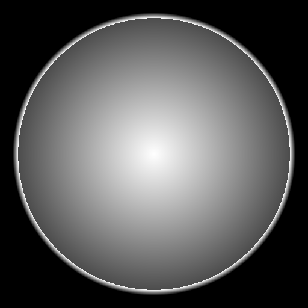

### Laboratory 1: Blending two images

#### First image

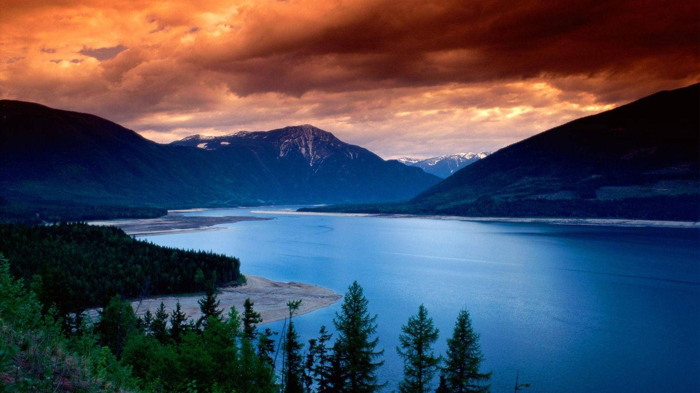

#### Second image


#### Alpha channel


#### Result

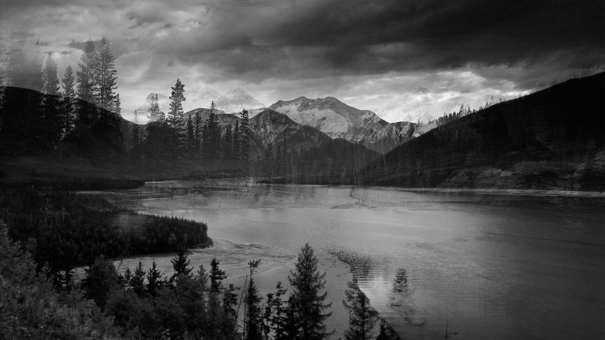

### Laboratory 2

#### Input image


#### Output with 2 bpp

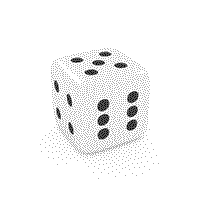

#### Output with 3 bpp


#### Output with 4 bpp

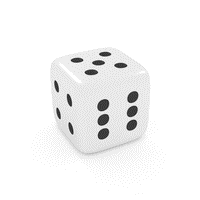

#### Output with 8 bpp

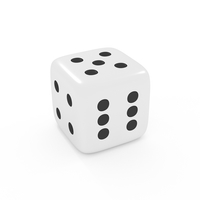

### Laboratory 3

#### Output images

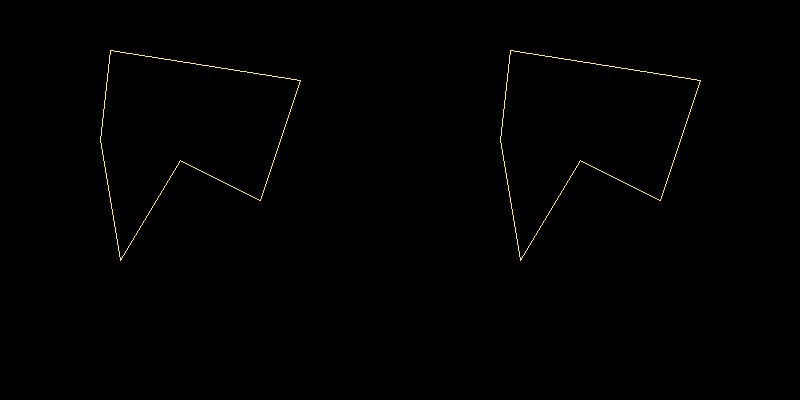

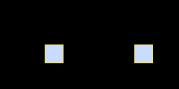

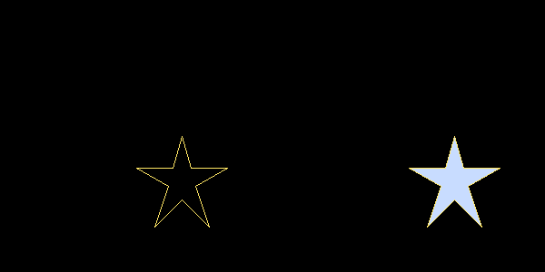

### Laboratory 4

#### Output images

#### Cross-segments

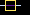


#### Bezier curves

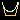


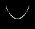